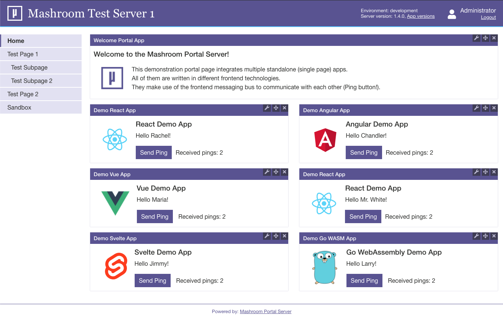

# Mashroom Server

## About ##

*Mashroom Server* is *Node.js* based **Integration Platform for Microfrontends**. It supports the integration of *Express* webapps and API's on the
server side and composing pages from multiple *Single Page Applications* on the client side (Browser). It also provides common infrastructure such 
as logging, i18n, storage and security out of the box and supports custom middleware and services in form of plugins.

From a technical point of view the core of *Mashroom Server* is a plugin loader that scans npm packages (package.json) for 
plugin definitions and loads them at runtime. Such a plugin could be an *Express* webapp or a *SPA* or more generally 
all kind of code it knows how to load, which is determined by the available plugin loaders. 
Plugin loaders itself are also just plugins so it is possible to extend the list of known plugin types.

Compared with the concepts in the Java world *Mashroom Server* would be an Application Server. And the *Mashroom Portal* plugin
has similar concepts than a Java Portal Server.

### Key features

 * Integration of existing _Express_ webapps
 * Shared middleware and services
 * Out of the box services for security, internationalization, storage and more 
 * Pluggable providers for security, storage and and many other services
 * Role based permissions for URL's (ACL's)
 * Single configuration file to override plugin default configurations
 * Hot deploy, undeploy and reload of all kind of plugins
 * No compile or runtime dependencies to the server 
 * Support for custom plugin types
 * Fast and lightweight
 * Portal plugin
    * Build pages from independent SPA's, even written in different technologies
    * Client-side message bus for inter-app communication
    * Proxying of REST API calls to prevent CORS problems
    * Life registration of _Remote Apps_ (SPA's that run on a different server)
    * JS API to programmatically load portal apps into an arbitrary DOM node (even within another app)
    * Role based permissions for pages and apps
    * Support for global libraries that can be shared between the apps
    * Support for theming
    * Admin UI to create pages and place apps via Drag'n'Drop
    * Hot reload of apps in development mode

## Quick Start

    git clone https://github.com/nonblocking/mashroom-portal-quickstart.git mashroom-portal-quickstart
    cd mashroom-portal-quickstart
    npm run setup
    npm start

Open http://localhost:5050 in your browser. Users: john/john, admin/admin

## Homepage

https://www.mashroom-server.com

## Full Documentation 

https://www.mashroom-server.com/documentation

## Development

After cloning the repository just run

    npm run setup
    
to install all dependencies and build the core packages.

To start the test server run

    npm run dev 
    
in packages/test/test-server1. The test server will be available at http://localhost:5050
