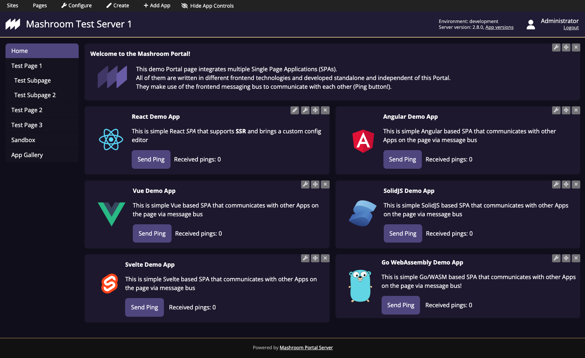

## About ##

*Mashroom Server* is a *Node.js* based **Microfrontend Integration Platform**. It supports the integration of *Express* web-apps on the
server side and composing pages from multiple *Single Page Applications* (*Portal Apps*) on the client side.
It also provides common infrastructure such as role-based security, communication (publish/subscribe), theming, i18n, storage,
and logging out of the box and supports custom middleware and services via plugins.

It allows it to implement SPAs completely independently and without a vendor lock-in, and to use it on arbitrary pages
with different configurations and even multiple times on the same page. Registered SPAs (*Portal Apps*) can also be loaded and unloaded dynamically,
hence they can be used as building blocks for *Composite Apps* or as part of a *dynamic Cockpit*.

The *Mashroom Portal* plugin, which is responsible for rendering *Portal Apps* is fully capable of *Hybrid Rendering*.
It renders the initial page requested by the user completely on the server-side (if all *Portal Apps* on the page also support SSR)
and dynamically exchanges the content on the client-side for subsequent pages.

From a technical point of view, the core of *Mashroom Server* is a plugin loader that scans npm packages for
plugin definitions (package.json, mashroom.json) and loads them at runtime.
Such a plugin could be an *Express* web-app or an *SPA* or more generally all kinds of code it knows how to load,
which is determined by the available plugin loaders.
Plugin loaders itself are also just plugins, so it is possible to add any type of custom plugin type.

### Key features

#### Portal

  * Registration of Single Page Applications (**Portal Apps**) written with any frontend framework
    (basically, you just need to implement a startup function and provide some metadata)
  * Registration of *Portal Apps* on remote servers or in Kubernetes clusters
  * Create static pages with registered *Portal Apps* as building blocks
  * Support for **dynamic cockpits** where Portal Apps are loaded (and unloaded) based on some user interaction or search results
  * Support for **Composite Apps** which can use any registered *Portal App* as building blocks
    (which again can serve as building blocks for other composite Apps)
  * Each *Portal App* receives a config object which can be different per instance and a number of JavaScript services
    (e.g., to connect to the message bus or to load other Apps)
  * Support for **Hybrid Rendering** for both the Portal pages and *Portal Apps*
    (if it supports server-side rendering, the initial HTML can be incorporated
    into the initial HTML page. Navigating to another page dynamically replaces the *Portal Apps* in the content area)
  * The *Portal App* config can be edited via *Admin Toolbar* or a custom Editor App which again is just a *Portal App*
  * Client-side message bus for inter-app communication, which can be extended to server-side messaging
    (to communicate with Apps in other browsers or even in third party systems)
  * Arbitrary (custom) layouts for pages
  * Extensive **theming** support
    (Themes can be written in any Express template language)
  * Support for multiple sites that can be mapped to virtual hosts
  * Proxying of REST API calls to avoid CORS problems (HTTP, SSE, WebSocket)
  * Support for sharing vendor libraries between *Portal Apps* (global libraries or importMaps)
  * Delivering of Theme and Portal App resources via CDN
  * Admin Toolbar to create pages and place Apps via Drag'n'Drop
  * **Hot reload** of *Portal Apps* in development mode

#### Core

  * Shared middlewares and services
  * **Service abstractions** for security, internationalization, messaging, HTTP proxying, memory cache, and storage
  * Existing provider plugins for security (OpenID Connect, LDAP), storage (File, MongoDB), messaging (MQTT, AMQP) and caching (Redis)
  * Integration of (existing) _Express_ web-apps
  * Integration of (existing) _Express_ (REST) APIs
  * Role- and IP-based **access control** for URLs
  * Definition of access restrictions for arbitrary resources (such as Sites, Pages, App instances)
  * Single configuration file to override plugin defaults
  * Support for "remote" plugins
  * Support for **custom plugin types**
  * Extensive **monitoring** and export in Prometheus format
  * Hot deploy, undeploy, and reload of all kinds of plugins
  * Native TypeScript support (all config files and plugins can be written in TypeScript)
  * No compile-time or runtime dependencies to the server
  * Fast and lightweight

## Quick Start

    git clone https://github.com/nonblocking/mashroom-portal-quickstart
    cd mashroom-portal-quickstart
    npm run setup
    npm start

Open http://localhost:5050 in your browser. Users: john/john, admin/admin

## Homepage

[https://www.mashroom-server.com](https://www.mashroom-server.com)

## Blog

[https://medium.com/mashroom-server](https://medium.com/mashroom-server)

## Youtube Channel

[https://www.youtube.com/@mashroomserver](https://www.youtube.com/@mashroomserver)

## Development Resources

### Plugin Examples

[https://github.com/nonblocking/mashroom-plugin-demos](https://github.com/nonblocking/mashroom-plugin-demos)

### Remote Portal App Demos

 * [https://github.com/nonblocking/mashroom-demo-remote-portal-app](https://github.com/nonblocking/mashroom-demo-remote-portal-app)
 * [https://github.com/nonblocking/mashroom-demo-ssr-remote-portal-app](https://github.com/nonblocking/mashroom-demo-ssr-remote-portal-app) (supports server-side rendering)

### Dynamic Cockpit Demo

[https://github.com/nonblocking/mashroom-demo-dynamic-cockpit](https://github.com/nonblocking/mashroom-demo-dynamic-cockpit)

### Microfrontend Platform based on Mashroom and Kubernetes Demo

[https://github.com/nonblocking/microfrontend-platform-kubernetes](https://github.com/nonblocking/microfrontend-platform-kubernetes)

### Full Documentation

[https://docs.mashroom-server.com](https://docs.mashroom-server.com)

