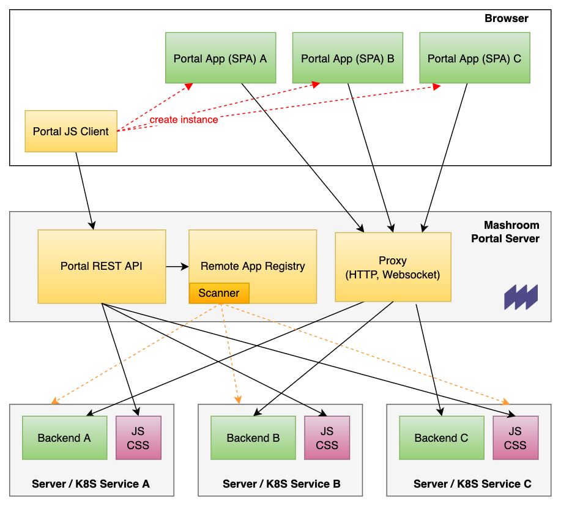
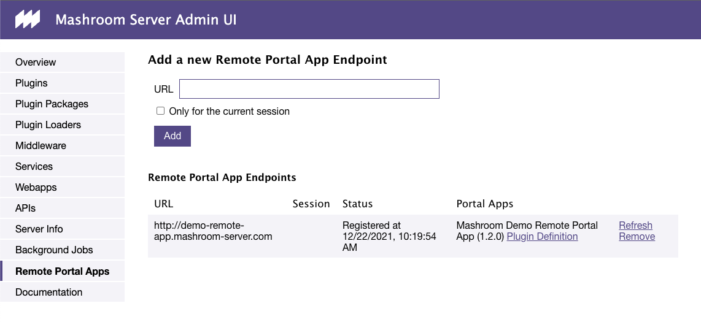
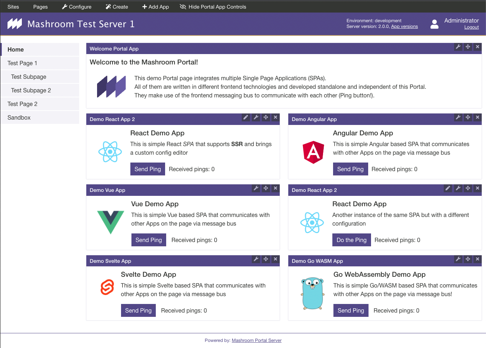
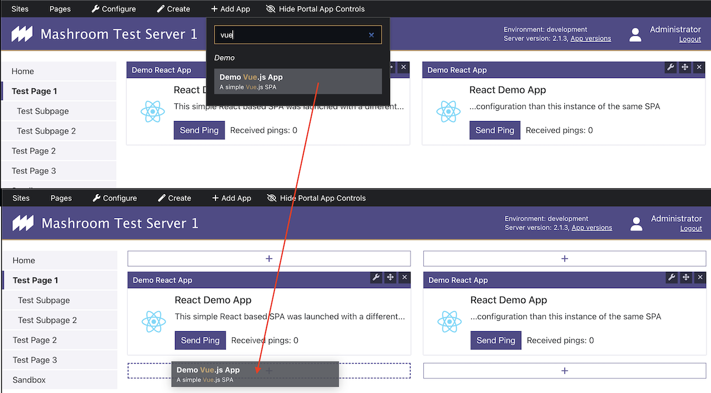
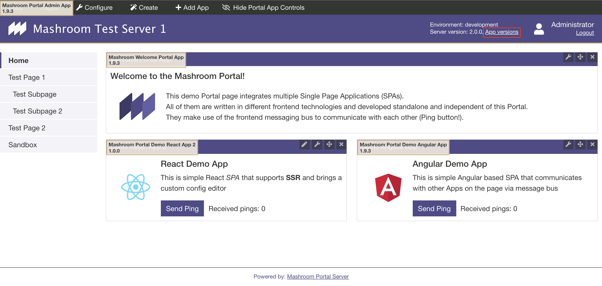

# Mashroom Server
Version: [version]

[https://www.mashroom-server.com](https://www.mashroom-server.com)

(c) 2020 nonblocking.at gmbh

## Table of contents

[toc]

## About

*Mashroom Server* is a *Node.js* based **Integration Platform for Microfrontends**. It supports the integration of *Express* webapps and API's on the
server side and composing pages from multiple *Single Page Applications* on the client side (Browser). It also provides common infrastructure such
as logging, i18n, storage and security out of the box and supports custom middleware and services in form of plugins.

From a technical point of view the core of *Mashroom Server* is a plugin loader that scans npm packages (package.json) for
plugin definitions and loads them at runtime. Such a plugin could be an *Express* webapp or a *SPA* or more generally
all kind of code it knows how to load, which is determined by the available plugin loaders.
Plugin loaders itself are also just plugins so it is possible to extend the list of known plugin types.

Compared with the concepts in the Java world *Mashroom Server* would be an Application Server. And the *Mashroom Portal* plugin
has similar concepts than a Java Portal Server.

### Key features

 * Integration of existing _Express_ webapps
 * Shared middlewares and services
 * Out of the box services for security, internationalization, messaging, HTTP proxying, memory cache and storage
 * Existing provider plugins for security (OpenID Connect, LDAP), storage (File, MongoDB), messaging (MQTT, AMQP) and caching (Redis)
 * Role and IP based access control for URLs
 * Single configuration file to override plugin default configurations
 * Support for custom plugin types
 * Extensive monitoring and export in Prometheus format
 * Hot deploy, undeploy and reload of all kind of plugins
 * No compile or runtime dependencies to the server
 * Fast and lightweight
 * Portal plugin
    * Build pages from independent SPA's, even written in different technologies
    * Client-side message bus for inter-app communication which can be extended to server-side messaging
      to communicate with apps in other browsers or even 3rd party systems
    * Proxying of REST API calls to avoid CORS problems
    * Life registration of _Remote Apps_ (SPA's that run on a different server)
    * JS API to programmatically load portal apps into an arbitrary DOM node (even within another app)
    * Support for multiple sites that can be mapped to virtual hosts
    * Role based permissions for pages and apps
    * Support for global libraries that can be shared between the apps
    * Support for theming
    * Admin Toolbar to create pages and place apps via Drag'n'Drop
    * Hot reload of apps in development mode

### Feature/Compatibility Matrix

|                     | Supported                                                                                                                      |
| ------------------- | -------------------------------------------------------------------------------------------------------------------------------|
| Operating Systems   | Linux, MacOS, Windows                                                                                                          |
| Node.js             | 10.x, 12.x                                                                                                                     |
| Authentication      | LDAP (Active Directory), OpenID Connect/OAuth2, local user database (JSON file)                                                |
| Authorization       | Role based; ACL (URL and HTTP method, based on roles and/or IP address); Resource permissions (Page, App instance, Topic, ...) |
| Security            | CSRF protection, [Helmet](https://helmetjs.github.io/) integration                                                             |
| Storage             | MongoDB, Plain JSON Files                                                                                                      |
| Memory Cache        | Local Memory, Redis                                                                                                            |
| Messaging           | MQTT (3.1, 3.1.1/4.0, 5.0), AMQP (1.0)                                                                                         |
| Session Storage     | Local Memory (no Cluster support), shared Filesystem, Redis, MongoDB                                                           |
| Clustering          | yes (tested with PM2)                                                                                                          |
| Monitoring          | CPU, Heap, Requests + Plugin Metrics; Exporter for Prometheus                                                                  |
| Desktop Browsers    | Chrome (latest), Firefox (latest), Safari (latest), Edge (latest), IE 11 (Default Theme only)                                  |
| Mobile Browsers     | Chrome (latest), Safari (latest)                                                                                               |

## Architecture


## Key concepts

### Plugin definition

A plugin definition consists of two parts:

 1. A plugin definition element in _package.json_ of the npm module
 2. A loader script (bootstrap)

A _package.json_ with a _Mashroom Server_ plugin definition looks like this:

```json
{
    "name": "my-webapp",
    "version": "1.0.0",
    "dependencies": {
        "express": "4.16.4"
    },
    "devDependencies": {
    },
    "scripts": {
        "build": "babel src -d dist"
    },
    "mashroom": {
        "devModeBuildScript": "build",
        "plugins": [
            {
                "name": "My Webapp",
                "type": "web-app",
                "bootstrap": "./dist/mashroom-bootstrap.js",
                "requires": [
                    "A special service plugin"
                ],
                "defaultConfig": {
                    "path": "/my/webapp"
                }
            }
        ]
    }
}
```
Multiple plugins can be defined within a npm module.

The _type_ element determines which plugin loader will be used to load the plugin. The optional _requires_ defines plugins
that must be loaded before this plugin can be loaded.
The content _defaultConfig_ differs per plugin type. It can be overwritten in the _plugins_ section of the server configuration.

The _devModeBuildScript_ property is optional. If present _npm run &lt;devModeBuildScript&gt;_ is executed in _devMode_ after every change in the package.

The bootstrap script for this case might look like this:

```js
// @flow

import webapp from './my-express-webapp';

import type {MashroomWebAppPluginBootstrapFunction} from 'mashroom/type-definitions';

const bootstrap: MashroomWebAppPluginBootstrapFunction = async (pluginName, pluginConfig, pluginContextHolder) => {
    return webapp;
};

export default bootstrap;
```

In typescript:

```js
import webapp from './my-express-webapp';

import {MashroomWebAppPluginBootstrapFunction} from 'mashroom/type-definitions';

const bootstrap: MashroomWebAppPluginBootstrapFunction = async (pluginName, pluginConfig, pluginContextHolder) => {
    return webapp;
};

export default bootstrap;
```


The context element allows access to the server configuration, the logger factory and all services.

### Plugin context

The plugin context allows access to the logger factory und all services. The plugin context is available via:

* The pluginContextHolder argument in the bootstrap function
* The express request object (*req.pluginContext*)

Examples:

```js
import type {MashroomLogger} from '@mashroom/mashroom/type-definitions';
import type {MashroomStorageService} from '@mashroom/mashroom-storage/type-definitions';

const bootstrap: MashroomWebAppPluginBootstrapFunction = async (pluginName, pluginConfig, pluginContextHolder) => {

    const pluginContext = pluginContextHolder.getPluginContext();
    const logger: MashroomLogger = pluginContext.loggerFactory('my.log.category');
    const storageService: MashroomStorageService = pluginContext.services.storage.service;

        //...
};
```

```js
app.get('/', (req, res) => {

    const pluginContext = req.pluginContext;
    const logger: MashroomLogger = pluginContext.loggerFactory('my.log.category');
    const storageService: MashroomStorageService = pluginContext.services.storage.service;

    //...
});
```

**IMPORTANT NOTE**: Never store the *pluginContext* outside a bootstrap or request handler because service references my change over time
when plugins are reloaded. But it save to store the *pluginContextHolder* instance.

## Setup

### Minimum Requirements

 * Node.js >= 10

### Install

Just checkout the [mashroom-portal-quickstart](https://github.com/nonblocking/mashroom-portal-quickstart) repo for a typical portal setup.
Or [mashroom-quickstart](https://github.com/nonblocking/mashroom-quickstart) if you don't need the portal plugin.

A single _package.json_ is enough to setup a server instance. Plugins are just npm dependencies.

### Configuration

The configuration files are expected in the folder where _mashroom_ is executed. Alternatively you can pass the root folder as argument:

    mashroom <path_to_config_files>

The following config files are loaded and merged together if present (in this order):

* mashroom.json
* mashroom.js
* mashroom.&lt;node_env&gt;.json
* mashroom.&lt;node_env&gt;.js
* mashroom.&lt;hostname&gt;.&lt;node_env&gt;.json
* mashroom.&lt;hostname&gt;.&lt;node_env&gt;.js
* mashroom.&lt;hostname&gt;.&lt;node_env&gt;.js

The typical configuration could look like this:

```json
{
    "name": "Mashroom Test Server 1",
    "port": 8080,
    "indexPage": "/portal",
    "xPowerByHeader": "Mashroom Server",
    "tmpFolder": "/tmp",
    "pluginPackageFolders": [{
        "path": "./node_modules/@mashroom"
     }, {
        "path": "./my-plugin-packages",
        "watch": true,
        "devMode": true
    }],
    "ignorePlugins": [],
    "plugins": {
        "Mashroom Session Middleware": {
            "provider": "Mashroom Session Filestore Provider",
            "session": {
            }
        },
        "Mashroom Session Filestore Provider": {
            "path": "./data/sessions",
            "ttl": 1200
        },
        "Mashroom Security Services": {
            "provider": "Mashroom Security Simple Provider",
            "acl": "./acl.json",
            "loginPage": "/login"
        },
        "Mashroom Security Simple Provider": {
            "users": "./users.json"
        },
        "Mashroom Storage Services": {
            "provider": "Mashroom Storage Filestore Provider"
        },
        "Mashroom Storage Filestore Provider": {
            "dataFolder": "./data/storage"
        },
        "Mashroom Internationalization Services": {
            "availableLanguages": ["en", "de"],
            "defaultLanguage": "en"
        },
        "Mashroom Http Proxy Services": {
            "rejectUntrustedCerts": false,
            "poolMaxSockets": 10
        }
    }
}

```

The same as a Javascript file:

```js
module.exports = {
    name: "Mashroom Test Server 1",
    port: 8080,
    indexPage: "/portal",
    xPowerByHeader: "Mashroom Server",
    tmpFolder: "/tmp",
    pluginPackageFolders: [{
         path: "./node_modules/@mashroom"
     }, {
        path: "./my-plugin-packages",
        devMode: true
    }],
    ignorePlugins: [],
    plugins: {

    }
}
```

Since version 1.3 the property values can also contain string templates and the environment variables are accessible via *env* object:

```json
{
    "name": "${env.USER}'s Mashroom Server",
    "port": 5050
}
```

#### Properties

 * _name_: The server name (default: Mashroom Server)
 * _port_: The port the server should bind to (default: 5050)
 * _indexPage_: The start page if the root ('/') is requested (default: /)
 * _xPowerByHeader_: The *x-powered-by* header to send; null disables the header (default: Mashroom Server)
 * _tmpFolder_: The tmp folder for plugin builds and so on (default: OS specific temp dir)
 * _pluginPackageFolders_: An array of folder paths that contain *Node.js* modules with *Mashroom Server* plugins
    An object in this array can have the following properties:
      * _path_: The folder path, relative to the config file (mandatory)
      * _watch_: Determines if this folder should be watched for changed, new or removed packages (default: false)
      * _devMode_: If this is true the server automatically builds plugins on changes before reloading it.
        This option enforces _watch_. (default: false)
 * _ignorePlugins_: An array of plugin names which shall be ignored (and not loaded)
 * _plugins_: This section can be used to override the *defaultConfig* of arbitrary plugins

### Security

To enable security you have to add the *mashroom-security* package and a provider package such as *mashroom-security-provide-simple*.

The security package provides access control lists based on URLs and a Service for managing and checking resource permissions manually.
Please read the *mashroom-security* documentation for more details.

The portal uses the security plugin to control the access to pages and portal apps. It also introduced a concept of fain grain
permissions (mapped to roles) which can be checked in portal apps and in backends (passed via HTTP header by the API Proxy).

### Logging

The logger is currently backed by [log4js](https://www.npmjs.com/package/log4js).

The configuration is expected to be in the same folder as *mashroom.cfg*. Possible config files are:

* log4js.&lt;hostname&gt;.&lt;node_env&gt;.js
* log4js.&lt;hostname&gt;.&lt;node_env&gt;.json
* log4js.&lt;hostname&gt;.js
* log4js.&lt;hostname&gt;.json
* log4js.&lt;node_env&gt;.js
* log4js.&lt;node_env&gt;.json
* log4js.js
* log4js.json

The first config file found from this list will be used. A file logger would be configured like this:

```json
    {
        "appenders": {
            "file1": {"type": "file", "filename": "log/mashroom.log", "maxLogSize": 10485760, "numBackups": 3},
            "file2": {
              "type": "file", "filename": "log/my-stuff.log", "maxLogSize": 10485760, "numBackups": 3,
              "layout":  {
                "type": "pattern",
                "pattern": "%d %p %X{sessionID} %X{clientIP} %X{username} %c - %m"
              }
            },
            "console": {"type": "console"}
        },
        "categories": {
            "default": {"appenders": ["file1", "console"], "level": "debug"},
            "my-stuff": {"appenders": ["file2"], "level": "info"}
        }
    }
```

The following built in context properties can be used with %X{<name>} or a custom layout:
* _clientIP_
* _browser_ (e.g. Chrome, Firefox)
* _browserVersion_
* _os_ (e.g. Windows)
* _sessionID_ (if a session is available)
* _portalAppName_ (if the request is related to a portal app)
* _portalAppVersion_ (if the request is related to a portal app)

You can use _logger.withContext()_ or _logger.addContext()_ to add context information.

For configuration details and possible appenders see [log4js-node Homepage](https://log4js-node.github.io/log4js-node/).

#### Logstash

To push the logs to logstash you can use the _logstash-http_ package:

```json
    "dependencies": {
      "@log4js-node/logstash-http": "^1.0.0"
    }
```

And configure log4js like this:

```json
{
  "appenders": {
    "logstash": {
      "type": "@log4js-node/logstash-http",
      "url": "http://elasticsearch:9200/_bulk",
      "application": "your-index"
    }
  },
  "categories": {
    "default": {
      "appenders": [ "logstash" ],
      "level": "info"
    }
  }
}
```

### Clustering

When you're going to run _Mashroom Server_ in a cluster you should keep in mind:

 * Use as session provider that provides clustering (such as _mashroom-session-provider-filestore_)
 * If you use file appenders you either have to make sure that your _log4js_ config creates a file per node process or
 you have to install _pm2-intercom_ if you're using _pm2_. Read the _log4js_ clustering documentation for details:
 [https://github.com/log4js-node/log4js-node/blob/master/docs/clustering.md](https://github.com/log4js-node/log4js-node/blob/master/docs/clustering.md)

A cluster safe log configuration could look like this:

```js
const NODE_ID = process.env.pm_id || process.pid;

module.exports = {
    appenders: {
        file: {'type': 'file', 'filename': `log/mashroom.${NODE_ID}.log`, 'maxLogSize': 10485760, 'numBackups': 3},
        console: {'type': 'console'}
    },
    categories: {
        default: {appenders: ['file', 'console'], 'level': 'info'}
    },
    disableClustering: true
};
```
### Health checks

There are a few integrated health checks available that can be used as probes for monitoring tools or to check the readiness/liveness of Kubernetes pods.

An overview of the health checks is available under http://&lt;host&gt;:&lt;port&gt;/mashroom/health

### Monitoring

_Mashroom Server_ gathers a lot of internal metrics that can be exposed in different formats. Currently there is only
an exporter for [Prometheus](https://prometheus.io) but it would be simple to write an exporter for a different format.

To enable the metrics and the Prometheus exporter add the following plugins:

 * @mashroom/mashroom-monitoring-metrics-collector
 * @mashroom/mashroom-monitoring-prometheus-exporter

The Prometheus metrics will be available at **/metrics**. An example [Grafana](https://grafana.com) Dashboard can be found
[in the Mashroom repo](https://github.com/nonblocking/mashroom/tree/master/packages/plugin-packages/mashroom-monitoring-prometheus-exporter/test/grafana-test/grafana/provisioning/dashboards/Mashroom%20Dashboard.json).

Here how it looks:


## Admin UI

The _Mashroom Server_ Admin UI is available under http://&lt;host&gt;:&lt;port&gt;/mashroom/admin


It contains:

 * General server information
 * Plugins with state and configuration
 * Middleware stack (with order)
 * All available services
 * All loaded webapps
 * Documentation

## Mashroom Portal

### Architecture


#### How does it work?

Every portal app (SPA) has to expose a global _bootstrap_ method. The _Portal Client_ fetches the app metadata from the
server, loads all required resources and calls then the _bootstrap_ with the configuration object and the DOM element
where the app should run in.

#### API Proxy

The API proxy allows the portal app to access it's REST API. The API can be deploy within *Mashroom Server* or be remote.

The access to a proxy url can be restricted to specific roles.

#### Remote apps

The Portal App resources (JavaScript and CSS files) can be remote. The *resourcesRoot* parameter of local pluings accept HTTP, HTTPS and FTP urls.

There is also a plugin to register portal apps running on a remote server. The remote apps have to expose the _package.json_
with the plugin definition at _http://&lt;remote-server&gt;/package.json_



##### Register a remote app with the mashroom-portal-remote-app-registry plugin

Open _/portal-remote-app-registry_, paste the URL into the input and lick _Add_:



After that you can add the new portal app via Drag'n'Drop where ever you want:


#### Messaging

The Portal comes with a client-side _MessageBus_ that can be used by Portal Apps to communicate with each other locally.

If server-side messaging (_mashroom-messaging_) and Websocket support (_mashroom-websocket_) is installed, the _MessageBus_ is
automatically connected to the server-side messaging facility and like this Portal Apps can communicate with Apps in other
browsers and even with 3rd party systems (when a external messaging system such as MQTT is connected).


### User Interface

#### Page layout


The *theme* is responsible for rendering the page. It defines where the main content is.
The portal adds the selected layout to the main content and the configured portal apps within the app areas of this layout.

#### Default start page with demo apps



#### Add a new portal app



#### Page settings


#### Show portal app versions

The default portal theme allows to show all portal app versions by clicking on _App versions_. You can enable it like
this in the _Mashroom_ config file:

```json
{
    "plugins": {
        "Mashroom Portal Default Theme": {
          "showEnvAndVersions": true
        }
    }
}
```



## Core

[mashroom](../../../core/mashroom/README.md) [inc]

## Plugins

[mashroom-security](../../mashroom-security/README.md) [inc]

[mashroom-security-provider-simple](../../mashroom-security-provider-simple/README.md) [inc]

[mashroom-security-provider-ldap](../../mashroom-security-provider-ldap/README.md) [inc]

[mashroom-security-provider-openid-connect](../../mashroom-security-provider-openid-connect/README.md) [inc]

[mashroom-security-provider-basic-wrapper](../../mashroom-security-provider-basic-wrapper/README.md) [inc]

[mashroom-security-default-login-webapp](../../mashroom-security-default-login-webapp/README.md) [inc]

[mashroom-csrf-protection](../../mashroom-csrf-protection/README.md) [inc]

[mashroom-helmet](../../mashroom-helmet/README.md) [inc]

[mashroom-storage](../../mashroom-storage/README.md) [inc]

[mashroom-storage-provider-filestore](../../mashroom-storage-provider-filestore/README.md) [inc]

[mashroom-storage-provider-mongodb](../../mashroom-storage-provider-mongodb/README.md) [inc]

[mashroom-session](../../mashroom-session/README.md) [inc]

[mashroom-session-provider-filestore](../../mashroom-session-provider-filestore/README.md) [inc]

[mashroom-session-provider-redis](../../mashroom-session-provider-redis/README.md) [inc]

[mashroom-session-provider-mongodb](../../mashroom-session-provider-mongodb/README.md) [inc]

[mashroom-http-proxy](../../mashroom-http-proxy/README.md) [inc]

[mashroom-websocket](../../mashroom-websocket/README.md) [inc]

[mashroom-messaging](../../mashroom-messaging/README.md) [inc]

[mashroom-messaging-external-provider-mqtt](../../mashroom-messaging-external-provider-mqtt/README.md) [inc]

[mashroom-messaging-external-provider-amqp](../../mashroom-messaging-external-provider-amqp/README.md) [inc]

[mashroom-memory-cache](../../mashroom-memory-cache/README.md) [inc]

[mashroom-memory-cache-provider-redis](../../mashroom-memory-cache-provider-redis/README.md) [inc]

[mashroom-i18n](../../mashroom-i18n/README.md) [inc]

[mashroom-browser-cache](../../mashroom-browser-cache/README.md) [inc]

[mashroom-vhost-path-mapper](../../mashroom-vhost-path-mapper/README.md) [inc]

[mashroom-vhost-path-mapper](../../mashroom-vhost-path-mapper/README.md) [inc]

[mashroom-monitoring-metrics-collector](../../mashroom-monitoring-metrics-collector/README.md) [inc]

[mashroom-monitoring-prometheus-exporter](../../mashroom-monitoring-prometheus-exporter/README.md) [inc]

[mashroom-monitoring-pm2-exporter](../../mashroom-monitoring-pm2-exporter/README.md) [inc]

[mashroom-portal](../../mashroom-portal/README.md) [inc]

[mashroom-portal-default-layouts](../../mashroom-portal-default-layouts/README.md) [inc]

[mashroom-portal-legacy-browser-support](../../mashroom-portal-legacy-browser-support/README.md) [inc]

[mashroom-portal-app-user-extradata](../../mashroom-portal-app-user-extradata/README.md) [inc]

[mashroom-portal-default-theme](../../mashroom-portal-default-theme/README.md) [inc]

[mashroom-portal-admin-app](../../mashroom-portal-admin-app/README.md) [inc]

[mashroom-portal-tabify-app](../../mashroom-portal-tabify-app/README.md) [inc]

[mashroom-portal-iframe-app](../../mashroom-portal-iframe-app/README.md) [inc]

[mashroom-portal-remote-app-registry](../../mashroom-portal-remote-app-registry/README.md) [inc]

[mashroom-portal-remote-app-registry-k8s](../../mashroom-portal-remote-app-registry-k8s/README.md) [inc]

[mashroom-portal-sandbox-app](../../mashroom-portal-sandbox-app/README.md) [inc]

## Demo Plugins

[mashroom-demo-webapp](../../mashroom-demo-webapp/README.md) [inc]

[mashroom-portal-demo-alternative-theme](../../mashroom-portal-demo-alternative-theme/README.md) [inc]

[mashroom-portal-demo-react-app](../../mashroom-portal-demo-react-app/README.md) [inc]

[mashroom-portal-demo-angular-app](../../mashroom-portal-demo-angular-app/README.md) [inc]

[mashroom-portal-demo-vue-app](../../mashroom-portal-demo-vue-app/README.md) [inc]

[mashroom-portal-demo-svelte-app](../../mashroom-portal-demo-svelte-app/README.md) [inc]

[mashroom-portal-demo-reasonreact-app](../../mashroom-portal-demo-reasonreact-app/README.md) [inc]

[mashroom-portal-demo-rest-proxy-app](../../mashroom-portal-demo-rest-proxy-app/README.md) [inc]

[mashroom-portal-demo-load-dynamically-app](../../mashroom-portal-demo-load-dynamically-app/README.md) [inc]

[mashroom-portal-demo-remote-messaging](../../mashroom-portal-demo-remote-messaging/README.md) [inc]

## 3rd Party Plugins

Coming soon.
