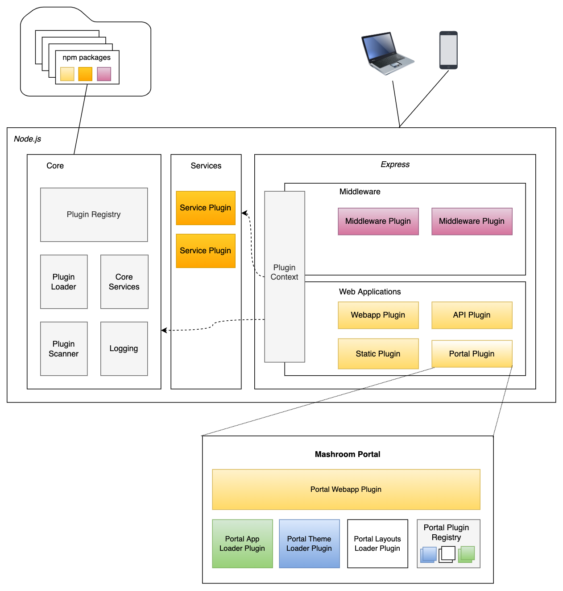
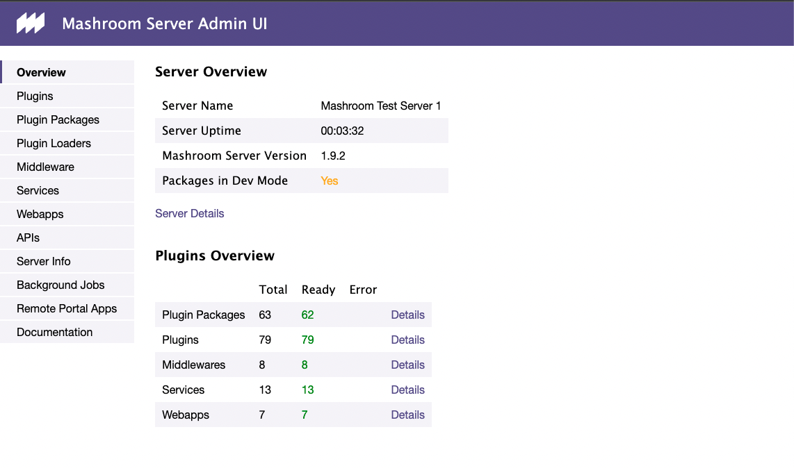
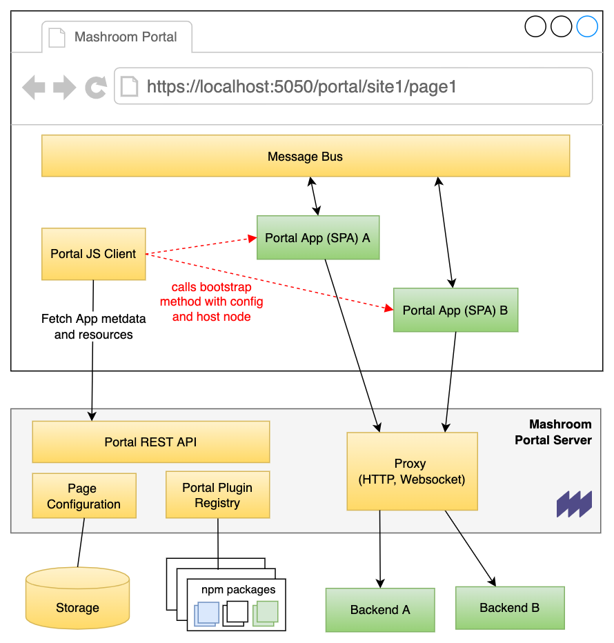
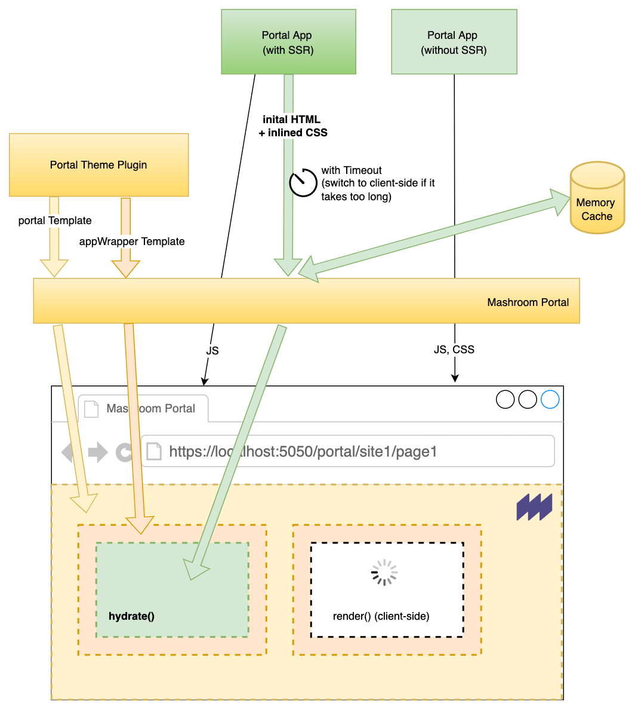
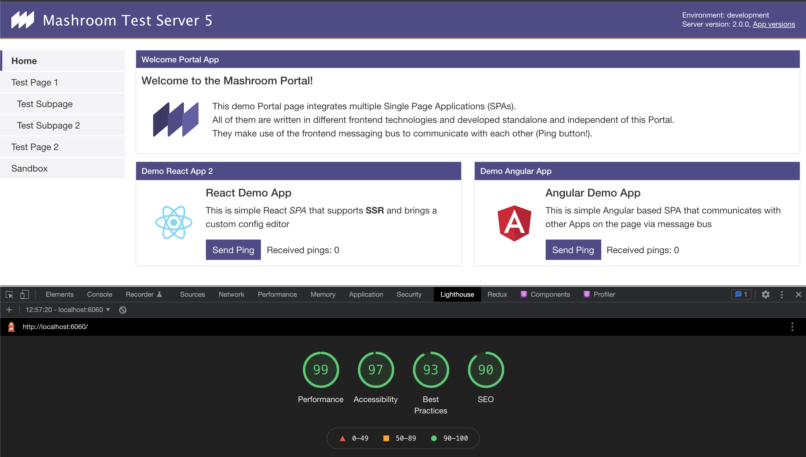
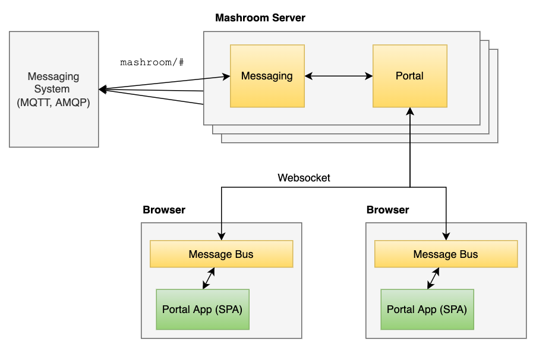
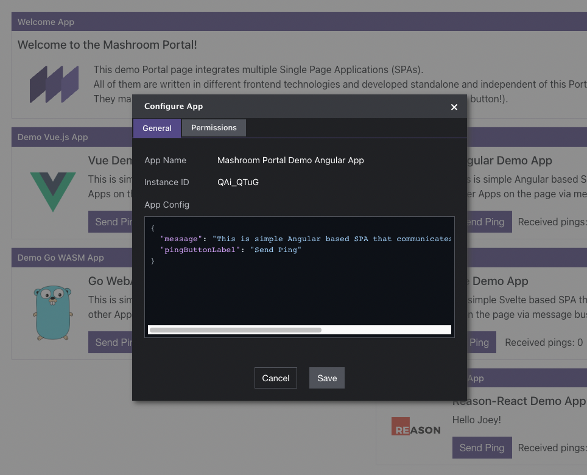

# Mashroom Server
Version: [version]

[https://www.mashroom-server.com](https://www.mashroom-server.com)

(c) 2022 nonblocking.at gmbh

## Table of contents

[toc]

## About

*Mashroom Server* is a *Node.js* based **Microfrontend Integration Platform**. It supports the integration of *Express* webapps on the
server side and composing pages from multiple *Single Page Applications* on the client side (Browser). It also provides common infrastructure such as
security, communication (publish/subscribe), theming, i18n, storage, and logging out of the box and supports custom middleware and services via plugins.

Mashroom Server allows it to implemented SPAs (and express webapps) completely independent and without a vendor lock-in, and to use it on arbitrary pages
with different configurations and even multiple times on the same page. It also allows it to restrict the access to resources (Pages, Apps) based on user roles.

From a technical point of view the core of *Mashroom Server* is a plugin loader that scans npm packages (package.json) for
plugin definitions and loads them at runtime. Such a plugin could be an *Express* webapp or a *SPA* or more generally
all kind of code it knows how to load, which is determined by the available plugin loaders.
Plugin loaders itself are also just plugins, so it is possible to extend the list of known plugin types.

### Key features

#### Portal

  * Registration of Single Page Applications written with any frontend framework
    (basically you just need to implement a startup function and provide some metadata)
  * Automatic registration of SPAs (**Remote Apps**) on remote servers or Kubernetes clusters
    (this allows independent life cycles and teams per SPA)
  * Create static pages with registered SPAs (Apps) as building blocks
  * Support for **dynamic cockpits** where Apps are loaded (and unloaded) based on some user interaction or search results
  * Support for **composite Apps** which can use any registered SPA as building blocks
    (which again can serve as building blocks for other composite Apps)
  * Each App receives a config object which can be different per instance and a number of JavaScript services
    (e.g. to connect to the message bus or to load other Apps)
  * The App config can be edited via Admin Toolbar or a custom Editor App which again is just a plain SPA
  * Client-side message bus for inter-app communication which can be extended to server-side messaging
    (to communicate with Apps in other browsers or even in 3rd party systems)
  * Support for **hybrid rendering** for both the Portal pages and SPAs
    (If an SPA supports server side rendering the initial HTML can be incorporated
    into the initial HTML page. Navigating to another page dynamically replaces the SPAs in the content area via client side rendering)
  * Arbitrary (custom) layouts for pages
  * Extensive **theming** support
    (Themes can be written in any Express template language)
  * Support for multiple sites that can be mapped to virtual hosts
  * Proxying of REST API calls to avoid CORS problems (HTTP, SSE, WebSocket)
  * Support for global libraries that can be shared between multiple SPAs
  * Delivering of Theme and Portal App resources via CDN
  * Admin Toolbar to create pages and place Apps via Drag'n'Drop
  * **Hot reload** of SPAs in development mode

#### Core

  * Shared middlewares and services
  * **Service abstractions** for security, internationalization, messaging, HTTP proxying, memory cache and storage
  * Existing provider plugins for security (OpenID Connect, LDAP), storage (File, MongoDB), messaging (MQTT, AMQP) and caching (Redis)
  * Integration of (existing) _Express_ webapps
  * Integration of (existing) _Express_ (REST) APIs
  * Role and IP based **access control** for URLs
  * Definition of access restrictions for arbitrary resources (such as Sites, Pages, App instances)
  * Single configuration file to override plugin defaults
  * Support for **custom plugin types**
  * Extensive **monitoring** and export in Prometheus format
  * Hot deploy, undeploy and reload of all kind of plugins
  * No compile or runtime dependencies to the server
  * Fast and lightweight

### Feature/Compatibility Matrix

|                     | Supported                                                                                                                      |
| ------------------- | -------------------------------------------------------------------------------------------------------------------------------|
| Operating Systems   | Linux, MacOS, Windows                                                                                                          |
| Node.js             | 12.x, 14.x, 16.x                                                                                                               |
| HTTP                | 1.0, 1.1, 2 + TLS 1.1, 1.2, 1.3                                                                                                 |
| Authentication      | LDAP (Active Directory), OpenID Connect/OAuth2, local user database (JSON file)                                                |
| Authorization       | Role based; ACL (URL and HTTP method, based on roles and/or IP address); Resource permissions (Page, App instance, Topic, ...) |
| Security            | CSRF protection, [Helmet](https://helmetjs.github.io/) integration                                                             |
| Storage             | MongoDB, Plain JSON Files                                                                                                      |
| Memory Cache        | Local Memory, Redis                                                                                                            |
| Messaging           | MQTT (3.1, 3.1.1/4.0, 5.0), AMQP (1.0)                                                                                         |
| Session Storage     | Local Memory (no Cluster support), shared Filesystem, Redis, MongoDB                                                           |
| API Proxy           | HTTP, HTTPS, SSE, WebSocket                                                                                                    |
| CDN                 | Any that can be configured as caching proxy                                                                                    |
| Clustering          | yes (tested with PM2)                                                                                                          |
| Monitoring          | CPU, Heap, Requests + Plugin Metrics; Exporter for Prometheus                                                                  |
| Desktop Browsers    | Chrome (latest), Firefox (latest), Safari (latest), Edge (latest), IE 11 (only with mashroom-portal-legacy-browser-support)    |
| Mobile Browsers     | Chrome (latest), Safari (latest)                                                                                               |

## Architecture



## Key concepts

### Plugin definition

A plugin definition consists of two parts:

 1. A plugin definition element, either in _package.json_ or a separate _mashroom.json_ file
 2. A loader script (bootstrap)

A _package.json_ with a _Mashroom Server_ plugin definition looks like this:

```json
{
    "$schema": "https://www.mashroom-server.com/schemas/mashroom-packagejson-extension.json",
    "name": "my-webapp",
    "version": "1.0.0",
    "dependencies": {
        "express": "4.16.4"
    },
    "devDependencies": {
    },
    "scripts": {
        "build": "babel src -d dist"
    },
    "mashroom": {
        "devModeBuildScript": "build",
        "plugins": [
            {
                "name": "My Webapp",
                "type": "web-app",
                "bootstrap": "./dist/mashroom-bootstrap.js",
                "requires": [
                    "A special service plugin"
                ],
                "defaultConfig": {
                    "path": "/my/webapp"
                }
            }
        ]
    }
}
```

The same in a separate _mashroom.json_
```json
{
    "$schema": "https://www.mashroom-server.com/schemas/mashroom-plugins.json",
    "devModeBuildScript": "build",
    "plugins": [
        {
            "name": "My Webapp",
            "type": "web-app",
            "bootstrap": "./dist/mashroom-bootstrap.js",
            "requires": [
                "A special service plugin"
            ],
            "defaultConfig": {
                "path": "/my/webapp"
            }
        }
    ]
}
```

Multiple plugins can be defined within a single npm package.

The _type_ element determines which plugin loader will be used to load the plugin. The optional _requires_ defines plugins
that must be loaded before this plugin can be loaded.
The content _defaultConfig_ differs per plugin type. It can be overwritten in the _plugins_ section of the server configuration.

The _devModeBuildScript_ property is optional. If present _npm run &lt;devModeBuildScript&gt;_ is executed in _devMode_ after every change in the package.

The bootstrap script for this case might look like this:

```ts
import webapp from './my-express-webapp';

import {MashroomWebAppPluginBootstrapFunction} from 'mashroom/type-definitions';

const bootstrap: MashroomWebAppPluginBootstrapFunction = async (pluginName, pluginConfig, pluginContextHolder) => {
    return webapp;
};

export default bootstrap;
```

The context element allows access to the server configuration, the logger factory and all services.

### Plugin context

The plugin context allows access to the logger factory und all services. The plugin context is available via:

  * The pluginContextHolder argument in the bootstrap function
  * The express request object (*req.pluginContext*)

Examples:

```ts
import type {MashroomLogger} from '@mashroom/mashroom/type-definitions';
import type {MashroomStorageService} from '@mashroom/mashroom-storage/type-definitions';

const bootstrap: MashroomWebAppPluginBootstrapFunction = async (pluginName, pluginConfig, pluginContextHolder) => {

    const pluginContext = pluginContextHolder.getPluginContext();
    const logger: MashroomLogger = pluginContext.loggerFactory('my.log.category');
    const storageService: MashroomStorageService = pluginContext.services.storage.service;

        //...
};
```

```ts
app.get('/', (req, res) => {

    const pluginContext = req.pluginContext;
    const logger: MashroomLogger = pluginContext.loggerFactory('my.log.category');
    const storageService: MashroomStorageService = pluginContext.services.storage.service;

    //...
});
```

<span class="panel-warning">
**NOTE**: Never store the *pluginContext* outside a bootstrap or request handler because service references my change over time
when plugins are reloaded. But it save to store the *pluginContextHolder* instance.
</span>

## Setup

### Minimum Requirements

 * Node.js >= 12

### Install

Just checkout the [mashroom-portal-quickstart](https://github.com/nonblocking/mashroom-portal-quickstart) repo for a typical portal setup.
Or [mashroom-quickstart](https://github.com/nonblocking/mashroom-quickstart) if you don't need the Portal plugin.

A single _package.json_ is enough to set up a server instance. Plugins are just npm dependencies.

### Configuration

The configuration files are expected in the folder where _mashroom_ is executed. Alternatively you can pass the root folder as argument:

    mashroom <path_to_config_files>

The following config files are loaded and merged together if present (in this order):

  * mashroom.json
  * mashroom.js
  * mashroom.&lt;node_env&gt;.json
  * mashroom.&lt;node_env&gt;.js
  * mashroom.&lt;hostname&gt;.&lt;node_env&gt;.json
  * mashroom.&lt;hostname&gt;.&lt;node_env&gt;.js
  * mashroom.&lt;hostname&gt;.&lt;node_env&gt;.js

The typical configuration could look like this:

```json
{
    "$schema": "https://www.mashroom-server.com/schemas/mashroom-server-config.json",
    "name": "Mashroom Test Server 1",
    "port": 8080,
    "indexPage": "/portal",
    "xPowerByHeader": "Mashroom Server",
    "tmpFolder": "/tmp",
    "pluginPackageFolders": [{
        "path": "./node_modules/@mashroom"
     }, {
        "path": "./my-plugin-packages",
        "watch": true,
        "devMode": true
    }],
    "ignorePlugins": [],
    "plugins": {
        "Mashroom Session Middleware": {
            "provider": "Mashroom Session Filestore Provider",
            "session": {
            }
        },
        "Mashroom Session Filestore Provider": {
            "path": "./data/sessions",
            "ttl": 1200
        },
        "Mashroom Security Services": {
            "provider": "Mashroom Security Simple Provider",
            "acl": "./acl.json"
        },
        "Mashroom Security Simple Provider": {
            "users": "./users.json",
            "loginPage": "/login"
        },
        "Mashroom Storage Services": {
            "provider": "Mashroom Storage Filestore Provider"
        },
        "Mashroom Storage Filestore Provider": {
            "dataFolder": "./data/storage"
        },
        "Mashroom Internationalization Services": {
            "availableLanguages": ["en", "de"],
            "defaultLanguage": "en"
        },
        "Mashroom Http Proxy Services": {
            "rejectUnauthorized": false,
            "poolMaxSockets": 10
        }
    }
}
```

The same as a Javascript file:

```js
module.exports = {
    name: "Mashroom Test Server 1",
    port: 8080,
    indexPage: "/portal",
    xPowerByHeader: "Mashroom Server",
    tmpFolder: "/tmp",
    pluginPackageFolders: [{
         path: "./node_modules/@mashroom"
     }, {
        path: "./my-plugin-packages",
        devMode: true
    }],
    ignorePlugins: [],
    plugins: {

    }
}
```

Since version 1.3 the property values can also contain string templates and the environment variables are accessible via *env* object:

```json
{
    "name": "${env.USER}'s Mashroom Server",
    "port": 5050
}
```

To enable HTTPS and/or HTTP2 you would add:

```json
{
    "httpsPort": 5443,
    "tlsOptions": {
        "key": "./certs/key.pem",
        "cert": "./certs/cert.pem"
    },
    "enableHttp2": true
}
```

#### Properties

 * _name_: The server name (default: Mashroom Server)
 * _port_: The port the server should bind to (default: 5050)
 * _httpsPort_: Additionally launch a HTTPS server on this port (requires _tlsOptions_ as well)
 * _tlsOptions_: Passed to [Node TLS](https://nodejs.org/api/tls.html#tls_tls_createserver_options_secureconnectionlistener)
    but the file paths (e.g. for "cert") are resolved relatively to the server config.
 * _enableHttp2_: Enable HTTP/2 for the HTTPS server. If you enable this WebSockets will no longer work.
 * _indexPage_: The start page if the root ('/') is requested (default: /)
 * _xPowerByHeader_: The *x-powered-by* header to send; null disables the header (default: Mashroom Server)
 * _tmpFolder_: The tmp folder for plugin builds and so on (default: OS specific temp dir)
 * _pluginPackageFolders_: An array of folder paths that contain *Node.js* modules with *Mashroom Server* plugins
    An object in this array can have the following properties:
      * _path_: The plugin folder path, relative to the config file (mandatory)
      * _watch_: Determines if this folder should be watched for changed, new or removed packages (default: false)
      * _devMode_: If this is true the server automatically builds plugins on changes before reloading it.
        This option enforces _watch_. (default: false)
 * _ignorePlugins_: An array of plugin names which shall be ignored (and not loaded)
 * _plugins_: This section can be used to override the *defaultConfig* of arbitrary plugins

### Security

To enable security you have to add the *mashroom-security* package and a provider package such as *mashroom-security-provide-simple*.

The security package provides access control lists based on URLs and a Service for managing and checking resource permissions manually.

<span class="panel-info">
**NOTE**: The security in the Portal and for Portal Apps (SPA) is described below in *Mashroom Portal* -> *Security*.
</span>

#### ACL

You can secure every URL in *Mashroom* with the ACL, based on user role or IP. For example:

```json
{
    "$schema": "https://www.mashroom-server.com/schemas/mashroom-security-acl.json",
    "/portal/**": {
        "*": {
            "allow": {
                "roles": ["Authenticated"]
            }
        }
    },
    "/mashroom/**": {
        "*": {
            "allow": {
                "roles": ["Administrator"],
                "ips": ["127.0.0.1", "::1"]
            }
        }
    }
}
```

<span class="panel-info">
**NOTE**: For more details check the *mashroom-security* documentation below.
</span>

#### Resource permissions

The *SecurityService* allows it to define and check resource permissions based on a *permission* key and the user roles. For example:

```ts
import type {MashroomSecurityService} from '@mashroom/mashroom-security/type-definitions';

export default async (req: Request, res: Response) => {
    const securityService: MashroomSecurityService = req.pluginContext.services.security.service;

    // Create a permission
    await securityService.updateResourcePermission(req, {
        type: 'Page',
        key: pageId,
        permissions: [{
            permissions: ['View'],
            roles: ['Role1', 'Role2']
        }]
    });

    // Check a permission
    const mayAccess = await securityService.checkResourcePermission(req, 'Page', pageId, 'View');

    // ...
}
```

This mechanism is used by the Portal for Site, Page and Portal App permissions.

<span class="panel-info">
**NOTE**: For more details check the *mashroom-security* documentation below.
</span>

#### HTTP Security Headers

Use the *mashroom-helmet* plugin to add the [Helmet](https://github.com/helmetjs/helmet) middleware,
which adds a bunch of HTTP headers to prevent XSS and other attacks.

#### CSRF

The *mashroom-csrf* plugin adds middleware that checks every POST, PUT and DELETE request for a CSRF token in the HTTP headers or the query.
You need to use the *MashroomCSRFService* to get the current token.

<span class="panel-info">
**NOTE**: The default Portal theme automatically adds the current CSRF token in a meta tag with the name *csrf-token*.
</span>

### Logging

The logger is currently backed by [log4js](https://www.npmjs.com/package/log4js).

The configuration is expected to be in the same folder as *mashroom.cfg*. Possible config files are:

  * log4js.&lt;hostname&gt;.&lt;node_env&gt;.js
  * log4js.&lt;hostname&gt;.&lt;node_env&gt;.json
  * log4js.&lt;hostname&gt;.js
  * log4js.&lt;hostname&gt;.json
  * log4js.&lt;node_env&gt;.js
  * log4js.&lt;node_env&gt;.json
  * log4js.js
  * log4js.json

The first config file found from this list will be used. A file logger would be configured like this:

```json
    {
        "appenders": {
            "file1": {"type": "file", "filename": "log/mashroom.log", "maxLogSize": 10485760, "numBackups": 3},
            "file2": {
              "type": "file", "filename": "log/my-stuff.log", "maxLogSize": 10485760, "numBackups": 3,
              "layout":  {
                "type": "pattern",
                "pattern": "%d %p %X{sessionID} %X{clientIP} %X{username} %c - %m"
              }
            },
            "console": {"type": "console"}
        },
        "categories": {
            "default": {"appenders": ["file1", "console"], "level": "debug"},
            "my-stuff": {"appenders": ["file2"], "level": "info"}
        }
    }
```

The following built in context properties can be used with %X{<name>} or a custom layout:

  * _clientIP_
  * _browser_ (e.g. Chrome, Firefox)
  * _browserVersion_
  * _os_ (e.g. Windows)
  * _sessionID_ (if a session is available)
  * _portalAppName_ (if the request is related to a Portal App)
  * _portalAppVersion_ (if the request is related to a Portal App)

You can use _logger.withContext()_ or _logger.addContext()_ to add context information.

For configuration details and possible appenders see [log4js-node Homepage](https://log4js-node.github.io/log4js-node/).

#### Logstash

To push the logs to logstash you can use the _logstash-http_ package:

```json
    "dependencies": {
      "@log4js-node/logstash-http": "^1.0.0"
    }
```

And configure log4js like this:

```json
{
  "appenders": {
    "logstash": {
      "type": "@log4js-node/logstash-http",
      "url": "http://elasticsearch:9200/_bulk",
      "application": "your-index"
    }
  },
  "categories": {
    "default": {
      "appenders": [ "logstash" ],
      "level": "info"
    }
  }
}
```

### Internationalization

The *mashroom-i18n* plugin provides a simple service to lookup messages on the file system based on the current user language.

You can use it like this from where ever the *pluginContext* is available:

```ts
import type {MashroomI18NService} from '@mashroom/mashroom-i18n/type-definitions';

export default (req: Request, res: Response) => {
    const i18nService: MashroomI18NService = req.pluginContext.services.i18n.service;

    const currentLang = i18nService.getLanguage(req);
    const message =  i18nService.getMessage('username', 'de');
    // message will be 'Benutzernamen'

    // ...
}
```

One the client-side (in Portal Apps) you can use an arbitrary i18n framework (such as [intl-messageformat](https://formatjs.io/docs/intl-messageformat/)).
The current Portal locale will be passed to the Apps with the *portalAppSetup*:

```ts
const bootstrap: MashroomPortalAppPluginBootstrapFunction = (portalAppHostElement, portalAppSetup, clientServices) => {
    const { lang } = portalAppSetup;
    // lang will be 'en' or 'fr' or whatever
    const { messageBus, portalAppService } = clientServices;
    // ...
};
```

### Caching

*Mashroom* tries to automatically use the most efficient caching mechanisms. All you need to do is to add the appropriate plugins.

#### Server-side

Add *mashroom-memory-cache* plugin and optionally *mashroom-memory-cache-provider-redis* if you want to use Redis instead of the local memory.
Many other plugins (such as *mashroom-storage* and *mashroom-portal*) will automatically detect it and use it (see their documentation for more details).

#### Browser

The *mashroom-browser-cache* plugin provides a service to set *Cache-Control* headers based on a policy. For example:

```ts
import type {MashroomCacheControlService} from '@mashroom/mashroom-browser-cache/type-definitions';

export default async (req: Request, res: Response) => {

    const cacheControlService: MashroomCacheControlService = req.pluginContext.services.browserCache.cacheControl;
    await cacheControlService.addCacheControlHeader('ONLY_FOR_ANONYMOUS_USERS', req, res);

    // ..
};
```

Other plugins (such as *mashroom-portal*) will automatically use it if present.

<span class="panel-info">
**NOTE**: This plugin will always set *no-cache* header in *devMode*.
</span>

### CDN

Since v2 *Mashroom* ships a CDN plugin that will automatically be used by *mashroom-portal* and other plugins to deliver static assets.

Basically, *mashroom-cdn* consists of a list of CDN hosts and a service to get the next host to use:

```ts
import type {MashroomCDNService} from '@mashroom/mashroom-cdn/type-definitions';

export default async (req: Request, res: Response) => {

    const cdnService: MashroomCDNService = req.pluginContext.services.cdn.service;

    const cdnHost = cdnService.getCDNHost();
    const resourceUrl = `${cdnHost}/<the-actual-path>`;

    // ..
};
```

<span class="panel-info">
**NOTE**: The *mashroom-cdn* plugin requires a CDN that works like a transparent proxy, which forwards an identical request to
the *origin* (in this case Mashroom) if does not exist yet.
</span>

### Virtual Host Path Mapping

The *mashroom-vhost-path-mapper* plugin can be used to map frontend paths to *internal* paths, based on virtual hosts.

So, lets say you want to map the *Mashroom Portal* site *site1*, reachable under http://localhost:5050/portal/site1,
to www.my-company.com. In that case you would configure the plugin like this:

```json
{
  "plugins": {
       "Mashroom VHost Path Mapper Middleware": {
           "hosts": {
              "www.my-company.com": {
                 "mapping": {
                    "/login": "/login",
                    "/": "/portal/site1"
                 }
              }
          }
       }
    }
}
```

If your *frontend base path* is different, e.g. www.my-company.com/foo, you would also have to set the *frontendBasePath* in the configuration.

<span class="panel-warning">
**NOTE**: All other plugins will only deal with the rewritten paths, keep that in mind especially when defining ACLs.
</span>

### Clustering

If you're going to run _Mashroom Server_ in a cluster you should keep in mind:

 * Use as session provider that can provide a shared session for all instances (such as _mashroom-session-provider-filestore_)
 * If you use *mashroom-messaging* to communicate between browser windows you need to configure an external broker
 * If you use *mashroom-memory-cache* you should configure Redis as shared cache server to maximize the hits
 * If you use *mashroom-storage* (e.g. for the Portal) you either have to use Mongo as backend or to use a shared folder (e.g. SAN) for all instances
 * If you use file log appenders you either have to make sure that your _log4js_ config creates a file per node process, or
 you have to install _pm2-intercom_ if you're using _pm2_. Read the _log4js_ clustering documentation for details:
 [https://github.com/log4js-node/log4js-node/blob/master/docs/clustering.md](https://github.com/log4js-node/log4js-node/blob/master/docs/clustering.md)

A cluster safe log configuration could look like this:

```js
const NODE_ID = process.env.pm_id || process.pid;

module.exports = {
    appenders: {
        file: {'type': 'file', 'filename': `log/mashroom.${NODE_ID}.log`, 'maxLogSize': 10485760, 'numBackups': 3},
        console: {'type': 'console'}
    },
    categories: {
        default: {appenders: ['file', 'console'], 'level': 'info'}
    },
    disableClustering: true
};
```

### Monitoring

_Mashroom Server_ gathers a lot of internal metrics that can be exposed in different formats. Currently, there are two exporters available:
 * for [Prometheus](https://prometheus.io)
 * for [PM2 monitoring](https://pm2.keymetrics.io/docs/usage/monitoring/)

To enable the metrics, just add  *@mashroom/mashroom-monitoring-metrics-collector* and one of the exporter plugins.

The Prometheus metrics will be available at **/metrics**. An example [Grafana](https://grafana.com) Dashboard can be found
[in the Mashroom repo](https://github.com/nonblocking/mashroom/tree/master/packages/plugin-packages/mashroom-monitoring-prometheus-exporter/test/grafana-test/grafana/provisioning/dashboards/Mashroom%20Dashboard.json).

Here how it looks:


### Health checks

There are a few integrated health checks available that can be used as probes for monitoring tools or to check the readiness/liveness of Kubernetes pods.

An overview of the health checks is available under http://&lt;host&gt;:&lt;port&gt;/mashroom/health

## Admin UI

The _Mashroom Server_ Admin UI is available under http://&lt;host&gt;:&lt;port&gt;/mashroom/admin



It contains:

 * General server information
 * Plugins with state and configuration
 * Middleware stack (with order)
 * All available services
 * All loaded webapps
 * Documentation

## Mashroom Portal

### Architecture



#### How does it work?

Every Portal App (SPA) has to expose a global _bootstrap_ method. The _Portal Client_ fetches the app metadata from the
server, loads all required resources and calls then the _bootstrap_ with the configuration object and the DOM element
where the app should run in.

### Proxy

The built-in proxy allows the Portal App to access internal APIs. It supports HTTP, Websocket and SSE.

The access to a proxy url can be restricted to specific roles.

### Remote Apps

Portal Apps (SPA) can reside on a remote server and automatically be registered. Currently, there are two different remote
registries that can also be combined:

 * _mashroom-portal-remote-app-registry_
 * _mashroom-portal-remote-app-registry-k8s_ (for Kubernetes)

Here is how it works:


#### Ad hoc register a remote app with the mashroom-portal-remote-app-registry plugin

Open _/mashroom/admin/ext/remote-portal-apps_, paste the URL into the input and lick _Add_:


After that you can add the new Portal App via Drag'n'Drop where ever you want:


### Server Side Rendering

Since v2 the Portal can render the whole Portal page on the server-side and even include the initial HTML of Portal Apps,
capable of server-side rendering.

<span class="panel-info">
**NOTE**: If an App support SSR it should provide its style in separate CSS file, because in that case the Portal will try
to inline all styles so everything gets rendered correctly without any extra resources.
</span>

To enable SSR in an App you have to:

  * Use the new plugin type *portal-app2*
  * Add a *ssrBootstrap* that will be executed on the server side
  * Check in the (client-side) *bootstrap* if there is a pre-rendered DOM and use *hydrate()* in that case

The *ssrBootstrap* could look like this in React:

```tsx
import React from 'react';
import {renderToString} from 'react-dom/server';
import App from './App';

import type {MashroomPortalAppPluginSSRBootstrapFunction} from '@mashroom/mashroom-portal/type-definitions';

const bootstrap: MashroomPortalAppPluginSSRBootstrapFunction = (portalAppSetup) => {
    const {appConfig, restProxyPaths, lang} = portalAppSetup;
    const dummyMessageBus: any = {};
    return renderToString(<App appConfig={appConfig} messageBus={dummyMessageBus}/>);
};

export default bootstrap;
```

<span class="panel-info">
**NOTE**: The server-side bootstrap will receive the same *portalAppSetup* like on the client-side, but no client services.
If you need the *messageBus* or other services make sure the App renders without them or with a mock implementation.
</span>

On the client-side you would do:

```tsx
import React from 'react';
import {render, hydrate, unmountComponentAtNode} from 'react-dom';
import App from './App';

import type {MashroomPortalAppPluginBootstrapFunction} from '@mashroom/mashroom-portal/type-definitions';

const bootstrap: MashroomPortalAppPluginBootstrapFunction = (element, portalAppSetup, clientServices) => {
    const {appConfig, restProxyPaths, lang} = portalAppSetup;
    const {messageBus} = clientServices;

    const ssrHost = element.querySelector('[data-ssr-host="true"]');
    if (ssrHost) {
        hydrate(<App appConfig={appConfig} messageBus={messageBus}/>, ssrHost);
    } else {
        render(<App appConfig={appConfig} messageBus={messageBus}/>, element);
    }
};

global.startMyApp = bootstrap;
```

Remote Apps would basically work the same, but the server-side bootstrap needs to be exposed as route that receives a POST
with the *portalAppSetup* in the content. Checkout the [Mashroom Demo SSR Portal App](https://github.com/nonblocking/mashroom-demo-remote-portal-app).

All put together rendering a page works like this:



<span class="panel-warning">
**NOTE**: Every App should support client-side rendering, because they can be added dynamically to a page.
If you don't want to render on the client (e.g. for security reasons) at least render an error message on the client-side.
</span>

#### Performance/SEO hints

SSR improves page performance and SEO heavily. To improve it further we recommend:

 * Consider the *renderTimoutMs* value in the Portal's *ssrConfig*. This timeout determines how long the Portal will wait for
   an SSR result. It is safe to use a very low value, because if the SSR takes to long it automatically switches to client-side rendering,
   but puts the result (when ready) into the memory cache. So, subsequent calls will get the cached SSR HTML.
 * Use the *mashroom-memory-cache*, because the Portal will use it to cache the results of server-side rendering
 * Use a reverse proxy for TLS termination and enable compression and caching there
 * Use a CDN to accelerate the delivering of resources
 * In your server-side rendering Apps make sure to avoid [Cumulative Layout Shift](https://web.dev/cls/)
   (e.g. by always defining height and width for media)
 * Use the [Google Lighthouse](https://developers.google.com/web/tools/lighthouse) to check your site:



### "SPA Mode"

The Portal supports dynamically replacing the content of a page (that's the layout + all Apps) by the content of another page.
This can be used to avoid full page loads and let the Portal behave like an SPA itself, so it basically can switch to client-side rendering.

The client-side rendering needs to be implemented in the *Theme*, which needs to the following during page navigation:

 * Update the URL via *window.history*
 * Update the navigation area (highlight the new page)
 * Fetch the page content of the target page:

```html
<!-- in the template -->
<a class="nav-link active"
   href="{{@root.siteBasePath}}{{friendlyUrl}}"
   onclick="return replacePageContent('{{pageId}}', '{{@root.siteBasePath}}{{friendlyUrl}}')"
   data-mr-page-id="{{pageId}}">
    {{title}}
</a>
```

```ts
import type {MashroomPortalClientServices, MashroomPortalPageContent} from '@mashroom/mashroom-portal/type-definitions';

const clientServices: MashroomPortalClientServices | undefined = (global as any).MashroomPortalServices;
if (!clientServices) {
    return;
}

(global as any).replacePageContent = (pageId: string, pageUrl: string): boolean => {
    showPageLoadingIndicator(true);
    clientServices.portalPageService.getPageContent(pageId).then(
        (content: MashroomPortalPageContent) => {
            if (content.fullPageLoadRequired || !content.pageContent) {
                // Full page load required!
                document.location.replace(pageUrl);
            } else {
                contentEl.innerHTML = content.pageContent;
                // Execute page scripts
                eval(content.evalScript);
                highlightPageIdInNavigation(pageId);
                window.history.pushState({ pageId }, '', pageUrl);
                showPageLoadingIndicator(false);
            }
        },
        (error) => {
            // If an error occurs we do a full page load
            console.error('Dynamically replacing the page content failed!', error);
            document.location.replace(pageUrl);
        }
    );
    return false;
}
```

<span class="panel-info">
**NOTE**: The Portal will automatically detect if the requested page is not compatible to the initial loaded one
(because the Theme oder Page Enhancements differ). In that case it will return ```fullPageLoadRequired: true```.
</span>

### Composite Apps

A *Composite App* is a higher order App, which uses other Portal Apps (SPAs) as building blocks. So, its App in App,
or SPA in SPA, or picture in picture ;-) Such a Composite App can itself be used as building block for another Composite App,
which can be continued infinite.

This approach takes advantage of *Mashroom Portal*'s ability to load any registered App into any DOM element.
Basically, you just render a *div* element in your SPA with a unique (random) ID and load the App like so:

```ts
// Get the portalAppService in the bootstrap
const bootstrap: MashroomPortalAppPluginBootstrapFunction = (element, portalAppSetup, clientServices) => {
    const {portalAppService} = clientServices;
    //...
}

// Load the app
const loadedApp = await portalAppService.loadApp(domElID, 'My App', null, /* position */ null, /* appConfig */ {
    someProp: 'foo',
});
```

And unload it like this:

```ts
await portalAppService.unloadApp(loadedApp.id);
```

Make sure you call unloadApp() if you want to remove/replace an App and not just remove the host DOM node,
because like that the resources are not properly removed from the browser.

Here for example the *Mashroom Portal Demo Composite App*:


<span class="panel-warning">
**NOTE**: A Composite App only runs in *Mashroom Portal* and leads to a vendor lock-in. At very least other integration hosts
need to provide a compatible implementation of *MashroomPortalAppService*.
</span>

### Dynamic Cockpits

One key feature of *Mashroom Portal* is the possibility to create dynamic pages (or cockpits) based:

 * Backend data (e.g. a search)
 * The available (registered) Portal Apps
 * Messages published on the message bus

This is quite similar to a *Composite App* but in this case the page loads a single (static) App, which takes over the page
and manages loading and unloading other Apps *outside* of itself. Typically, the names of the Apps that get loaded are not pre-defined,
but determined from some *metaInfo* of the available Apps. So, such a cockpit can be dynamically extended by just adding
new Apps with some *capabilities* (at runtime).

To find Apps you would use the *portalAppService* like this:

```ts
const availableApps = await portalAppService.getAvailableApps();
const appToShowWhatever = availableApps.filter(({metaInfo}) => metaInfo?.canShow === 'whatever');
```

Have a look at this [Demo Dynamic Cockpit](https://github.com/nonblocking/mashroom-demo-dynamic-cockpit), it consist of a central
search bar and tries to load found data with Apps with apropriate *metaInfo*. E.g. this App could load customers:

```json
{
    "plugins": [
        {
            "name": "Mashroom Dynamic Cockpit Demo Customer Details App",
            // ...
            "defaultConfig": {
                "metaInfo": {
                    "demoCockpit": {
                        "viewType": "Details",
                        "entity": "Customer"
                    }
                },
                // ...
            }
        }
    ]
}
```

### Theming

A *Mashroom Portal* Theme can be written with any [template engine that works with Express](https://expressjs.com/en/resources/template-engines.html).

You need to implement three templates:
 * *portal*: A Portal page
 * *appWrapper*: Renders the Portal App wrapper (optional, can be omitted)
 * *appError*: Renders the error if loading an App fails (optional, can be omitted)

<span class="panel-info">
**NOTE**: If you want to have a type-safe template we recommend using [React](https://github.com/reactjs/express-react-views).
Have a look at *mashroom-portal-demo-alternative-theme* for an example.
</span>

#### Themable Portal Apps

Obviously, *theming* only works properly if all the Apps on a page regard the currently applied theme and in particular **do not**:

 * Just hardcode colors
 * Override "global" styles (e.g. for headers, inputs, etc.)
 * Bring their own fonts

Here some best practices:

 * In your Theme
     * Ship the style for all HTML elements and a common grid system (such as [bootstrap](https://getbootstrap.com/))
     * Define your UI component library in pure CSS without any JavaScript or markup (like bootstrap does it)
     * Expose your design constants (colors, fonts, ...) via CSS variables or utility classes
 * In your Apps:
     * Implement your UI components with the framework of your choice but use the CSS classes and the given structure from the Theme
     * Use only custom classes to apply your style within the App
     * Make sure your custom classes don't collide by using [CSS modules](https://blog.logrocket.com/how-to-configure-css-modules-webpack/)
       or prefixing them with some unique key
     * For colors, fonts and such use the CSS variables or utility classes exposed by the Theme
     * To be able to run your Apps standalone make sure the relevant parts of the Theme are available as standalone CSS file

### Messaging

The Portal comes with a client-side _MessageBus_ that can be used by Portal Apps to communicate with each other locally.

If server-side messaging (_mashroom-messaging_) and Websocket support (_mashroom-websocket_) is installed, the _MessageBus_ is
automatically connected to the server-side messaging facility and like this Portal Apps can communicate with Apps in other
browsers and even with 3rd party systems (when a external messaging system such as MQTT is connected).



### Page Enhancements

Page enhancement plugins allow to add some extra script or style to a page. Either to any page or based on some rules
(e.g. page URL or the user agent).

Checkout the *mashroom-portal* documentation for details.

### Portal App Enhancements

Portal app enhancement plugins can be used to modify the *portalAppSetup* of some (or any) Apps before loading.
It can also be used to add custom services on the client side (passed with *clientServices* to every App).

A typical use case would be to add some extra data to the *user* or to augment the *appConfig*.

Checkout the *mashroom-portal* documentation for details.

### Security

The Mashroom Portal uses the security plugin to control the access to pages and Portal Apps. It also introduced a concept of fine grain
permissions (mapped to roles) which can be checked in Portal Apps and in backends (passed via HTTP header by the API Proxy).

#### Portal App Security

If a user requires specific roles to be able to load an App (dynamically) you have to set the *defaultRestrictViewToRoles*
in the plugin definition. Otherwise, any user, which is able to access the Portal API (which can be controlled via ACL), will
be able to load it.

<span class="panel-info">
**NOTE**: Users with the role *Administrator* are able to load **all** Apps, regardless of *defaultRestrictViewToRoles*.
They are also able to override/redefine the *view* permission when adding Apps to a page.
</span>

Within Portal Apps you should not work with roles but with abstract *permission* keys such as "mayDeleteCustomer". In the plugin definition
this keys can then be mapped to roles like this:

```json
"defaultConfig": {
  "rolePermissions": {
    "mayDeleteCustomer": ["Role1", "Role2"]
  }
}
```

And the *permission* can be checked like this:

```ts
const bootstrap: MashroomPortalAppPluginBootstrapFunction = (portalAppHostElement, portalAppSetup, clientServices) => {
    const {appConfig, user: {permissions, username, displayName, email}} = portalAppSetup;

    // True if user has role "Role1" OR "Role2"
    if (permissions.mayDeleteCustomer) {
        // ...
    }
}
```

#### Securing backend access

Proxy access can be restricted by adding a *restrictToRole* property in the plugin definition:

```json
"defaultConfig": {
  "proxies": {
    "spaceXApi": {
      "targetUri": "https://api.spacexdata.com/v3",
      "sendPermissionsHeader": false,
      "restrictToRoles": ["Role1"]
    }
  }
}
```

<span class="panel-info">
**NOTE**: Not even users with the *Administrator* role can override that restriction. So, even if they can
load a restricted App they will not be able to access the backend.
</span>

Furthermore, it is possible to pass the Portal App security context to the backend via HTTP headers.
This is useful if you want to check some fine grain permissions there as well.

Headers that can be passed to the Backend:

 * X-USER-PERMISSIONS: A comma separated list of the permission keys that resolve to true; can be activated by setting
   *sendPermissionsHeader* to true on the proxy definition
 * X-USER-NAME and others: Can be activated by adding the *mashroom-http-proxy-add-user-headers* plugin
 * X-USER-ID-TOKEN: The ID token if the OpenID-Connect is used a security provider;
   can be activated by adding the *mashroom-http-proxy-add-id-token* plugin

#### Site and Page Security

Sites and Pages can be secured by:

 * The ACL
 * Individually, via Admin Toolbar (see below)

Both approaches can be combined.

### User Interface

#### Page layout


The *theme* is responsible for rendering the page. It defines where the main content is.
The portal adds the selected layout to the main content and the configured Portal Apps within the app areas of this layout.

#### Default start page with demo apps


#### Add a new Portal App

As an *Administrator* you can add Portal Apps via Admin Toolbar: *Add Apps*


#### Portal App configuration

After adding an App you can click on the *Configure* icon to edit the *appConfig* and the permissions:



#### Custom App Config Editor

Instead of the default JSON editor you can define a custom editor App for you *appConfig*.
The custom editor is itself a plain Portal App (SPA) which gets an extra *appConfig* property *editorTarget*
of type *MashroomPortalConfigEditorTarget* that can be used to communicate back with the Admin Toolbar:

```ts
const bootstrap: MashroomPortalAppPluginBootstrapFunction = (portalAppHostElement, portalAppSetup, clientServices) => {
    const {appConfig: {editorTarget}} = portalAppSetup;

    if (!editorTarget || !editorTarget.pluginName) {
        throw new Error('This app can only be started as App Config Editor!');
    }

    const currentAppConfig = editorTarget.appConfig;

    // ...

    // When the user is done:
    editorTarget.updateAppConfig(updatedAppConfig);
    editorTarget.close();

    //...
};
```

Here for example the *mashroom-portal-demo-react-app2* plugin which has a custom editor:


#### Show Portal App versions

The default portal theme allows to show all Portal App versions by clicking on _App versions_. You can enable it like
this in the _Mashroom_ config file:

```json
{
    "plugins": {
        "Mashroom Portal Default Theme": {
          "showEnvAndVersions": true
        }
    }
}
```


#### Adding a new page

As an *Administrator* you can add a new Page from the Admin Toolbar: *Create* -> *Create New Page*:


After that you can start to place Portal Apps via *Add Apps*.

#### Adding a new site

As an *Administrator* you can add a new Site from the Admin Toolbar: *Create* -> *Create New Page*:


After that you can start to add additional pages.

## Core Services

[mashroom](../../../core/mashroom/CoreServices.md) [inc]

## Available Plugins

[mashroom-security](../../mashroom-security/README.md) [inc]

[mashroom-security-provider-simple](../../mashroom-security-provider-simple/README.md) [inc]

[mashroom-security-provider-ldap](../../mashroom-security-provider-ldap/README.md) [inc]

[mashroom-security-provider-openid-connect](../../mashroom-security-provider-openid-connect/README.md) [inc]

[mashroom-security-provider-basic-wrapper](../../mashroom-security-provider-basic-wrapper/README.md) [inc]

[mashroom-security-default-login-webapp](../../mashroom-security-default-login-webapp/README.md) [inc]

[mashroom-csrf-protection](../../mashroom-csrf-protection/README.md) [inc]

[mashroom-helmet](../../mashroom-helmet/README.md) [inc]

[mashroom-error-pages](../../mashroom-error-pages/README.md) [inc]

[mashroom-storage](../../mashroom-storage/README.md) [inc]

[mashroom-storage-provider-filestore](../../mashroom-storage-provider-filestore/README.md) [inc]

[mashroom-storage-provider-mongodb](../../mashroom-storage-provider-mongodb/README.md) [inc]

[mashroom-session](../../mashroom-session/README.md) [inc]

[mashroom-session-provider-filestore](../../mashroom-session-provider-filestore/README.md) [inc]

[mashroom-session-provider-redis](../../mashroom-session-provider-redis/README.md) [inc]

[mashroom-session-provider-mongodb](../../mashroom-session-provider-mongodb/README.md) [inc]

[mashroom-http-proxy](../../mashroom-http-proxy/README.md) [inc]

[mashroom-http-proxy-add-user-headers](../../mashroom-http-proxy-add-user-headers/README.md) [inc]

[mashroom-http-proxy-add-id-token](../../mashroom-http-proxy-add-id-token/README.md) [inc]

[mashroom-websocket](../../mashroom-websocket/README.md) [inc]

[mashroom-messaging](../../mashroom-messaging/README.md) [inc]

[mashroom-messaging-external-provider-mqtt](../../mashroom-messaging-external-provider-mqtt/README.md) [inc]

[mashroom-messaging-external-provider-amqp](../../mashroom-messaging-external-provider-amqp/README.md) [inc]

[mashroom-memory-cache](../../mashroom-memory-cache/README.md) [inc]

[mashroom-memory-cache-provider-redis](../../mashroom-memory-cache-provider-redis/README.md) [inc]

[mashroom-i18n](../../mashroom-i18n/README.md) [inc]

[mashroom-background-jobs](../../mashroom-background-jobs/README.md) [inc]

[mashroom-browser-cache](../../mashroom-browser-cache/README.md) [inc]

[mashroom-cdn](../../mashroom-cdn/README.md) [inc]

[mashroom-robots](../../mashroom-robots/README.md) [inc]

[mashroom-vhost-path-mapper](../../mashroom-vhost-path-mapper/README.md) [inc]

[mashroom-monitoring-metrics-collector](../../mashroom-monitoring-metrics-collector/README.md) [inc]

[mashroom-monitoring-prometheus-exporter](../../mashroom-monitoring-prometheus-exporter/README.md) [inc]

[mashroom-monitoring-pm2-exporter](../../mashroom-monitoring-pm2-exporter/README.md) [inc]

[mashroom-portal](../../mashroom-portal/README.md) [inc]

[mashroom-portal-default-layouts](../../mashroom-portal-default-layouts/README.md) [inc]

[mashroom-portal-legacy-browser-support](../../mashroom-portal-legacy-browser-support/README.md) [inc]

[mashroom-portal-app-user-extradata](../../mashroom-portal-app-user-extradata/README.md) [inc]

[mashroom-portal-default-theme](../../mashroom-portal-default-theme/README.md) [inc]

[mashroom-portal-admin-app](../../mashroom-portal-admin-app/README.md) [inc]

[mashroom-portal-tabify-app](../../mashroom-portal-tabify-app/README.md) [inc]

[mashroom-portal-iframe-app](../../mashroom-portal-iframe-app/README.md) [inc]

[mashroom-portal-remote-app-registry](../../mashroom-portal-remote-app-registry/README.md) [inc]

[mashroom-portal-remote-app-registry-k8s](../../mashroom-portal-remote-app-registry-k8s/README.md) [inc]

[mashroom-portal-sandbox-app](../../mashroom-portal-sandbox-app/README.md) [inc]

[mashroom-portal-remote-messaging-app](../../mashroom-portal-remote-messaging-app/README.md) [inc]

## Demo Plugins

[mashroom-demo-webapp](../../mashroom-demo-webapp/README.md) [inc]

[mashroom-portal-demo-alternative-theme](../../mashroom-portal-demo-alternative-theme/README.md) [inc]

[mashroom-portal-demo-react-app2](../../mashroom-portal-demo-react-app2/README.md) [inc]

[mashroom-portal-demo-react-app](../../mashroom-portal-demo-react-app/README.md) [inc]

[mashroom-portal-demo-angular-app](../../mashroom-portal-demo-angular-app/README.md) [inc]

[mashroom-portal-demo-vue-app](../../mashroom-portal-demo-vue-app/README.md) [inc]

[mashroom-portal-demo-svelte-app](../../mashroom-portal-demo-svelte-app/README.md) [inc]

[mashroom-portal-demo-rest-proxy-app](../../mashroom-portal-demo-rest-proxy-app/README.md) [inc]

[mashroom-portal-demo-load-dynamically-app](../../mashroom-portal-demo-load-dynamically-app/README.md) [inc]

