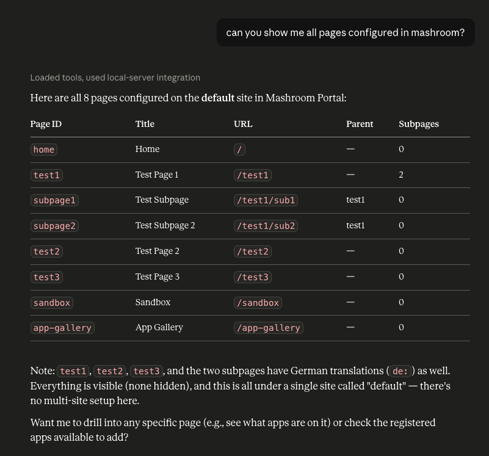

# Mashroom MCP Server

Plugin for [Mashroom Server](https://www.mashroom-server.com), a **Microfrontend Integration Platform**.

A minimal MCP plugin that allows agents to register new Portal Apps (Microfrontends) and to place them on pages.

## Usage

If *node_modules/@mashroom* is configured as a plugin path, add **@mashroom/mashroom-mcp-server** as *dependency*.

The MCP server will be available under *http://localhost:5050/mcp*.

> [!WARNING]
> The MCP server currently has no security whatsoever, so don't install in on production servers.
> Also, the route /mcp must be accessible without authentication.

Check out the documentation of your coding agent how to register an MCP server:

 * Claude Code: https://code.claude.com/docs/en/mcp-quickstart
 * Codex: https://learn.chatgpt.com/docs/extend/mcp?surface=cli
 * VSC: https://code.visualstudio.com/docs/agent-customization/mcp-servers
 * JetBrains Junie: https://junie.jetbrains.com/docs/junie-plugin-mcp-settings.html

Example conversations:

